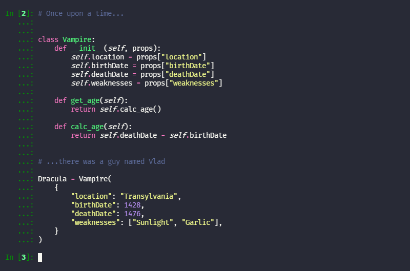

### [Pygments](http://pygments.org/)

#### Install using Git

If you are a git user, you can install the theme and keep up to date by cloning the repo:

    $ git clone https://github.com/dracula/pygments.git

#### Install manually

Download using the [GitHub .zip download](https://github.com/dracula/pygments/archive/master.zip) option and unzip them.

#### Activating theme

You can generate the CSS stylesheet (also included in this repository) by using the included `dracula.py` file and the [Pygments Command Line Interface](http://pygments.org/docs/cmdline/):

1.  [Download Pygments](http://pygments.org/download/) on your machine
2.  Check install location by attempting to install again (may vary depending on Python setup, e.g., Anaconda) by running.

    ```shell
    pip install Pygments
    ```

    Which will return:

    ```
    Requirement already satisfied: Pygments in /path/to/pygments
    ```

    Therefore:

    - For an Anaconda setup it should be in `~/anaconda3/lib/python3.x/site-packages/pygments`
    - For a non-Anaconda setup it should be in `/usr/local/lib/python3.x/dist-packages/pygments`

3.  Copy `dracula.py` into the `styles` folder.

4.  Run the following command on your terminal:

    `pygmentize -S dracula -f html > dracula.css`

#### Activating theme in iPython

To use with iPython:

1. Run iPython on your Terminal of choice.

   `ipython`

2. To create the blank configuration files, run:

   ```
   ipython profile create [profilename]
   ```

   If you leave out the profile name, the files will be created for the `default` profile. These will typically be located in `~/.ipython/profile_default/`, and will be named `ipython_config.py`.

3. Open `ipython_config.py` file and append the following:

   ```python
   c = get_config()

   c.TerminalInteractiveShell.highlighting_style = "dracula"
   c.TerminalInteractiveShell.true_color = True
   ```


